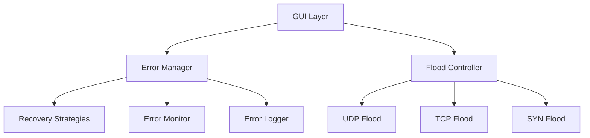
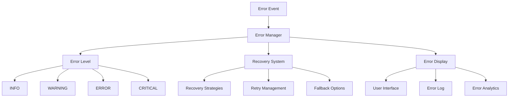
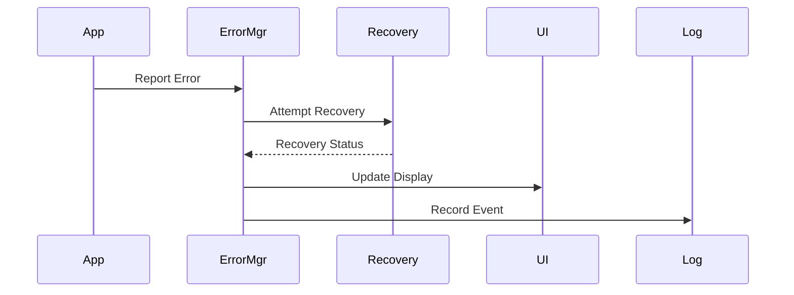
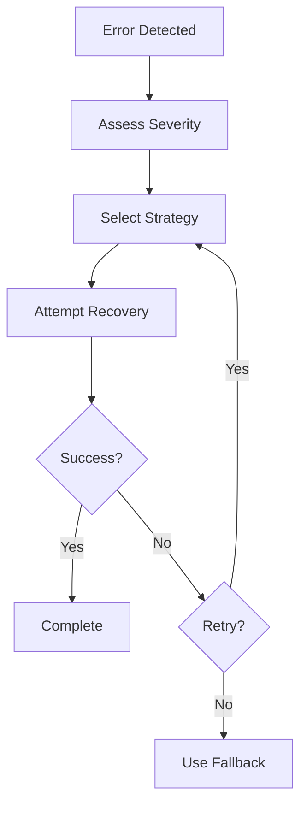

# System Patterns - Port Flooding Test Tool

## Architecture Overview

### 1. Core Components


### 2. Error Handling Architecture


## Design Patterns

### 1. Error Management
- **Observer Pattern**
  - Error events notification
  - UI updates
  - Log synchronization

- **Strategy Pattern**
  - Error recovery strategies
  - Interface detection methods
  - Logging approaches

- **Factory Pattern**
  - Error object creation
  - Recovery strategy selection
  - Logger instantiation

### 2. Recovery System
- **Command Pattern**
  - Recovery actions
  - Retry operations
  - Rollback procedures

- **Chain of Responsibility**
  - Error severity handling
  - Recovery attempt sequence
  - Fallback mechanisms

- **State Pattern**
  - Error states
  - Recovery progress
  - System status

### 3. Monitoring System
- **Decorator Pattern**
  - Error context enrichment
  - Log enhancement
  - Status updates

- **Composite Pattern**
  - Error aggregation
  - Status composition
  - Report generation

## Component Relationships

### 1. Error Flow


### 2. Recovery Process


## Implementation Details

### 1. Error Types
```python
class ErrorLevel(Enum):
    INFO = "INFO"
    WARNING = "WARNING"
    ERROR = "ERROR"
    CRITICAL = "CRITICAL"

class FloodTesterError:
    message: str
    level: ErrorLevel
    details: Dict[str, Any]
    timestamp: datetime
    recovered: bool
    recovery_attempts: int
```

### 2. Recovery Strategies
```python
class ErrorManager:
    recovery_strategies: Dict[str, Callable]
    max_recovery_attempts: int
    errors: Dict[str, FloodTesterError]
    
    def handle_error(self, error_type: str, 
                    message: str, 
                    level: ErrorLevel) -> bool:
        # Error handling implementation
        
    def attempt_recovery(self, error_type: str) -> bool:
        # Recovery implementation
```

### 3. Monitoring System
```python
class ErrorMonitor:
    error_counts: Dict[ErrorLevel, int]
    active_errors: List[FloodTesterError]
    recovery_status: Dict[str, bool]
    
    def update_display(self, error: FloodTesterError):
        # Display update implementation
        
    def log_error(self, error: FloodTesterError):
        # Logging implementation
```

## Best Practices

### 1. Error Handling
- Centralized error management
- Structured error types
- Comprehensive error context
- Automated recovery where possible

### 2. Recovery Strategies
- Maximum retry limits
- Graduated retry delays
- Fallback mechanisms
- Resource protection

### 3. Monitoring
- Real-time status updates
- Error analytics
- Performance tracking
- User feedback

## Future Considerations

### 1. Scalability
- Distributed error handling
- Enhanced recovery strategies
- Advanced analytics
- Performance optimization

### 2. Maintainability
- Modular error systems
- Configurable recovery
- Extensible monitoring
- Documentation automation

### 3. User Experience
- Interactive error resolution
- Predictive error prevention
- Custom reporting
- Advanced visualization 